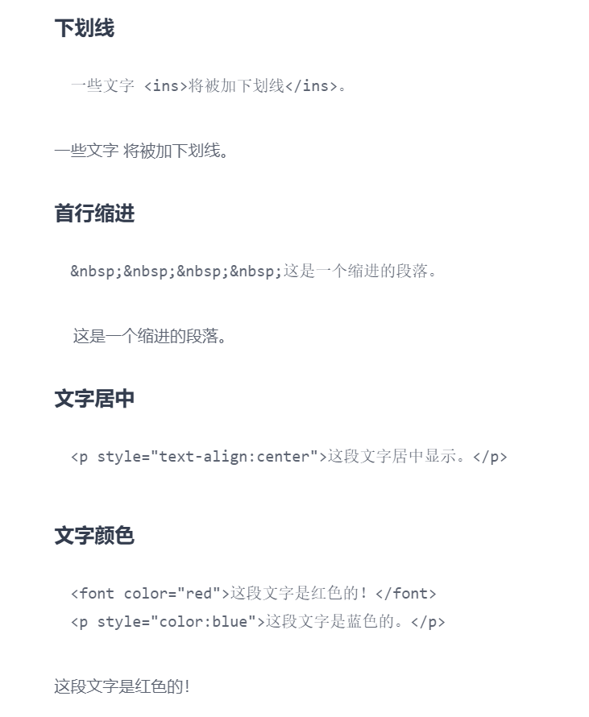
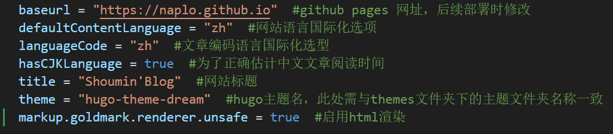
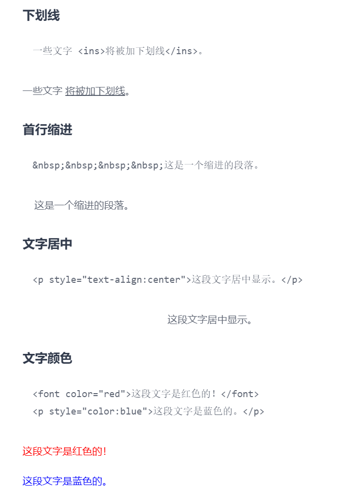

Hugo搭建的网站默认不渲染原生html标签和危险链接，需要手动配置开启。

<!--more-->

## 起因
在编写markdown语法学习记录时，发现hugo默认不渲染html标签，查看官方文档发现需要手动配置开启，在此记录。

## 参考资料
1. [Hugo官方文档](https://hugo.opendocs.io/getting-started/%E9%85%8D%E7%BD%AE%E6%A0%87%E8%AE%B0%E8%AF%AD%E8%A8%80/)

## 问题对策
修改根目录下的`hugo.md`文件，添加`unsafe=true`标记。

启用后效果如下：
