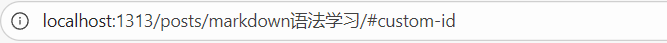

为了方便写博文，需要熟练掌握markdown语法，在此作为学习记录。

<!--more-->

## 前言
我本来想使用obsidian来编写博文，但是发现有些语法在GitHub Pages上无法渲染，在找到解决方案之前，只能先使用vscode+原生md语法来编写了。


## 参考资料
1. [Markdown教程](https://markdown.com.cn/)


## 基础语法
### 标题
markdown的标题需要在标题内容前输入多个`#`号（数量表示标题等级），中间使用一个空格` `分隔，例如：

```
#### 这是四级标题
```

渲染效果：

#### 这是四级标题

markdown的标题最多有6级。


### 段落
markdown中的段落需要使用空白行将多行文字分隔，否则将被视为一个被空格分隔的段落，例如：

```
这是一个
段落

这是第二个

段落
```

渲染效果：

这是一个
段落

这是第二个

段落

在md文档中，通常不建议首行缩进。


### 换行
想要在一个段落中换行，需要在行末添加两个空格`  `，例如：

```
这是第一行文字  
这是第二行文字

这是第二段文字
```

渲染效果：

这是第一行文字  
这是第二行文字

这是第二段文字


### 强调
markdown中有两种强调格式：粗体和斜体。

粗体：在需要强调的内容前后使用两个星号`**`或下划线`__`。  
斜体：在需要强调的内容前后使用一个星号`*`或下划线`_`。

例如：

```
这是**粗体**  
这是*斜体*
```

渲染效果：

这是**粗体**  
这是*斜体*


### 引用
要创建一个引用块，需要在段落前使用右尖括号`>`，例如：

```
>这是一个引用块
>
>>这是一个嵌套引用块
```

渲染效果：

>这是一个引用块
>
>>这是一个嵌套引用块
>
>- 其他元素

引用块支持嵌套、多段落、其他元素。


### 列表
markdown支持创建两种列表：有序列表和无序列表。

有序列表：在列表项前添加数字并紧跟一个英文句点和空格`1. `。  
无序列表：在列表项前添加一个减号和空格`- `，或加号和空格`+ `，或星号和空格`* `。

例如：

```
1. 第一项
3. 第三项
2. 第二项
    1. 嵌套列表
    - 嵌套列表

- 无序列表
    1. 嵌套列表
```

渲染效果：

1. 第一项
3. 第三项
2. 第二项
    1. 嵌套列表
    - 嵌套列表

- 无序列表
    1. 嵌套列表

有序列表的数字不必按数学顺序排列，但列表应当以数字1起始。  
列表可以相互嵌套，也可以嵌套其他元素，例如引用块、代码块、图片。


### 代码
markdown支持两种代码格式：行内代码和代码块。

行内代码：在需要表示为代码的内容前后使用反引号`` ` ``分隔。  
代码块：将代码块的每一行缩进至少四个空格或一个制表符。

例如：

```
这是`行内代码`

    &lt;html>
      &lt;head>
      &lt;head>
    &lt;html>
```

渲染结果如下：

这是`行内代码`

    &lt;html>
      &lt;head>
      &lt;head>
    &lt;html>


### 分割线
markdown中创建分割线，需要在单独一行中使用三个或多个星号`***`、减号`---`或下划线`___`，并且不能包含其他内容。例如：

```
***

---

___
```

渲染效果是一样的：

---


### 链接
markdown中创建链接的完整语法为：`[超链接显示名](超链接地址 "超链接title")`。

其中超链接title部分是可选的，并且超链接显示名和超链接本身支持其他格式化符号（如加粗、斜体、代码、列表、引用等）。

对于简单的网址和邮箱地址，可以使用尖括号分隔表示。  


例如：

```
这是一个[GitHub首页](https://github.com "GitHub")超链接。

这是一个[`代码样式`](https://github.com)超链接

- 这是一个[列表样式](https://github.com)超链接。

<https://github.com>

<fake@example.com>
```

渲染效果：

这是一个[GitHub首页](https://github.com "GitHub")超链接。

这是一个[`代码样式`](https://github.com)超链接

- 这是一个[列表样式](https://github.com)超链接。

<https://github.com>

<fake@example.com>


### 图片
markdown中插入图片的完整语法为：``。

其中图片资源路径可以是网络url，也可以是本地图片的绝对或相对路径。

可以为图片添加超链接。

例如：

```


[](https://naplo.github.io/)
```

渲染效果：


[](https://naplo.github.io/)


### 转义字符
需要显示用于格式化markdown文档的字符，需要在字符前添加反斜杠`\`。

例如：

```
\* 这是一个句子。
```

渲染效果：

\* 这是一个句子。

对于html文档中的特殊字符`<`和`&`，markdown支持自动转义，具体参见[markdown教程](https://markdown.com.cn/basic-syntax/escaping-characters.html)。


### 内嵌HTML标签
支持markdown的编辑器会在渲染时将markdown文档转化为html文档，因此，markdown语法本质上是对html语法的封装。

对于markdown不支持的html标签，可以直接在文档中使用，而不需要额外的标注。

使用html标签语法有时会比markdown语法要更方便，例如链接标签`<a>`、图片标签``等，可以很方便地设置文本颜色或图片尺寸。

行级内联标签：html的行级内联标签（如`<span>`、`<cite>`、`<del>`）可以直接在markdown文档的段落、列表或标题中使用。  
区块标签：html的区块标签必须在前后加上空行，以便于内容区分，并且不可以使用tab或空格来缩进这些元素的开始和结尾标签。

例如：

```
<cite>**斜体**</cite>**行内级联标签**

上文

<table>
  <tr>
    <td>**区块标签**</td>
  </tr>
<table>

下文
```

渲染效果：

<cite>**斜体**</cite>行内级联标签

上文

<table>
  <tr>
    <td>**区块标签**</td>
  </tr>
<table>

下文

注意，在html区块标签内markdown语法将失效。


## 扩展语法
### 表格
markdown支持使用管道符`|`和三个或以上的分隔符`---`创建列表，例如：

```
|序号|姓名|
|----|---|
|1|张三|
|2|李四|
```

渲染效果：

|序号|姓名|
|---|---|
|1|张三|
|2|李四|

**对齐**：可以通过在标题分隔行中使用冒号`:`来设置列的对齐方式，例如：

```
|序号   |姓名   |性别|
|:----|---:|:---:|
|1|张三|男|
|2|李老四|男|
```

渲染效果：


|序号   |姓名   |性别|
|:----|---:|:---:|
|1|张三|男|
|2|李老四|男|

**格式化**：表格内的文字支持使用markdown的强调、链接、行内代码语法。


### 围栏代码块
更常用的代码块语法是在代码块前后行添加三个反引号` ``` `，并且可以在代码块前反引号旁标注语法高亮类型，例如：

    ```python
    print("hello world")
    ```

渲染结果：

```python
print("hello world")
```


### 脚注
markdown支持创建和引用脚注。

创建脚注的语法格式：`[^1]: 脚注参考`。  
引用脚注的语法格式：`脚注引用[^1]`。

例如：

```
Here's a simple footnote,[^1] and here's a longer one.[^bignote]

[^1]: This is the first footnote.

[^bignote]: Here's one with multiple paragraphs and code.

    Indent paragraphs to include them in the footnote.

    `{ my code }`

    Add as many paragraphs as you like.
```

渲染效果：

Here's a simple footnote,[^1] and here's a longer one.[^bignote]

[^1]: This is the first footnote.

[^bignote]: Here's one with multiple paragraphs and code.

    Indent paragraphs to include them in the footnote.

    `{ my code }`

    Add as many paragraphs as you like.

脚注参考可以放在除列表、引用、表格之外的任何位置，而不需要放在文档末尾，渲染时会自动在末尾生成。  
脚注标识可以是数字或字母，脚注引用会自动按顺序编号。


### 标题编号
大部分markdown处理器支持给标题进行自动编号，以便于生成目录或者链接到标题的网页链接。

还有一部分markdown处理器支持给标题进行自定义编号，例如：

```
#### 四级标题 {#custom-id}
```

渲染结果：

#### 四级标题 {#custom-id}




### 定义列表
一些markdown处理器支持创建术语及其对应的定义列表，具体语法为：在第一行输入术语，在下一行输入一个冒号和定义，中间使用空格分隔，例如：

```
First Term
: This is the definition of the first term.

Second Term
: This is one definition of the second term.
: This is another definition of the second term.
```

渲染效果：

First Term
: This is the definition of the first term.

Second Term
: This is one definition of the second term.
: This is another definition of the second term.


### 删除线
使用删除线，需要在被标注删除的内容前后添加两个波浪线`~~`，例如：

```
这是~~删除线~~。
```

渲染效果：

这是~~删除线~~。


### 任务列表
创建任务列表，需要在任务项前添加一个减号和一对方括号，中间用空格分隔，例如：

```
- [x] 任务1
- [ ] 任务2
```

渲染效果：

- [x] 任务1
- [ ] 任务2


### emoji
一些markdown处理器支持直接复制粘贴emoji，或者使用emoji简码，例如：

```
去露营了！ :tent: 很快回来。

真好笑！ :joy:
```

渲染效果：

去露营了！ :tent: 很快回来。

真好笑！ :joy:


### 自动网址链接
许多markdown处理器会自动将url转换为链接，即使没有使用尖括号，此时可以使用反引号`来消除链接，例如：

```
https://github.com

`https://github.com`
```

渲染效果：

https://github.com

`https://github.com`


## 语法变通
除此之外，还有一些语法变通技巧非常使用，参见[markdown教程](https://markdown.com.cn/hacks.html)。