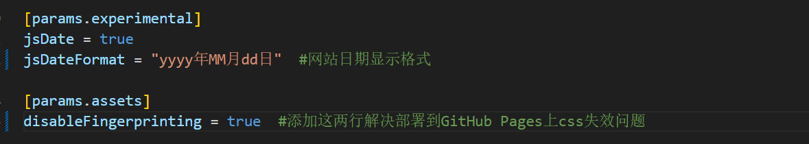
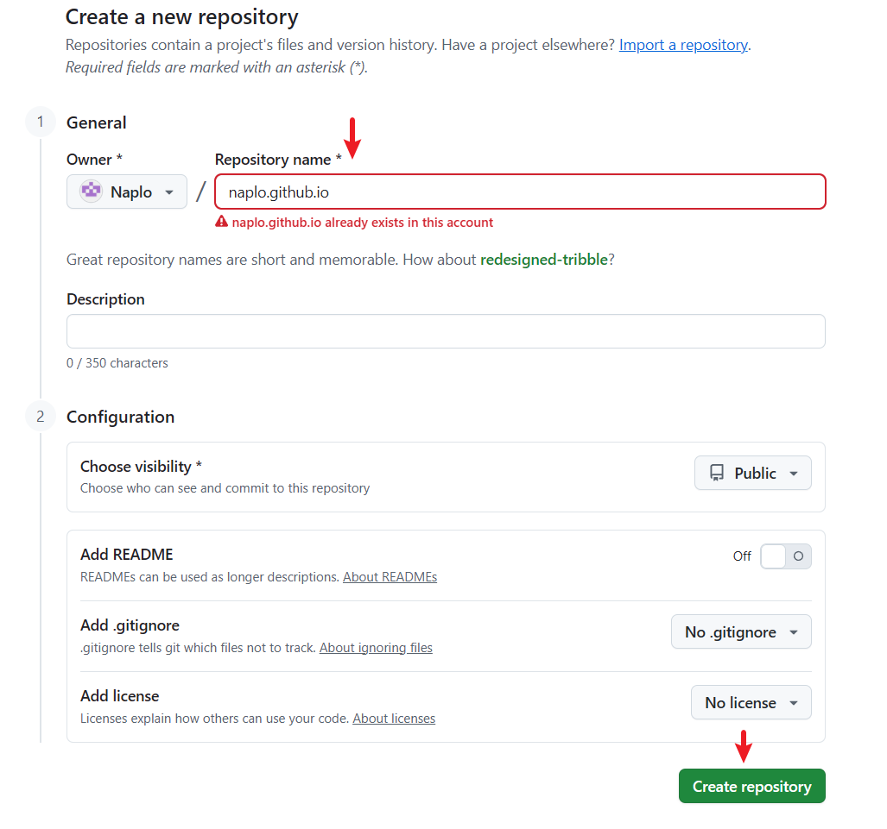
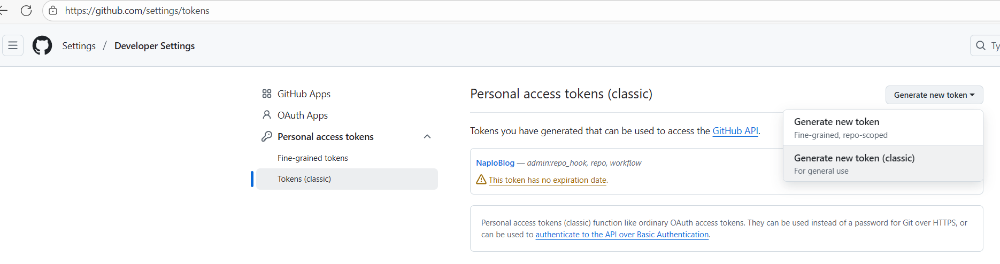
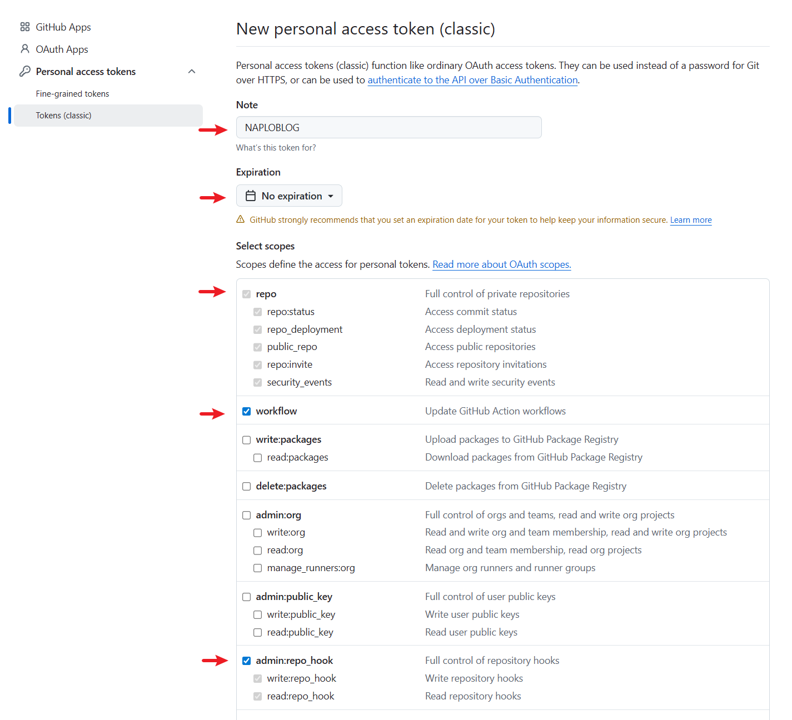
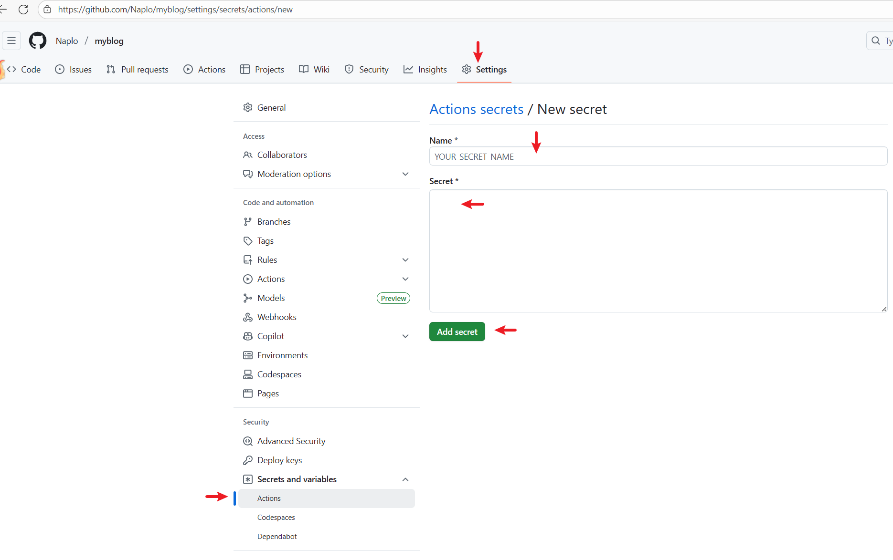
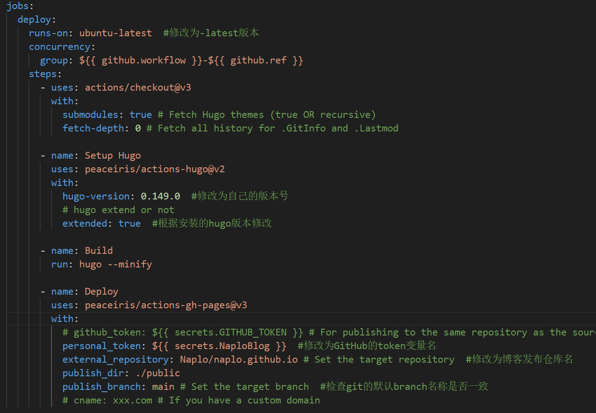
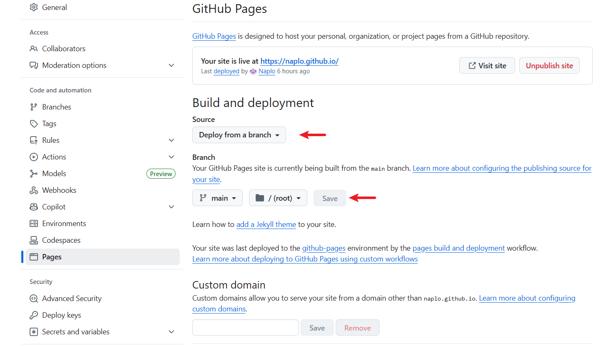
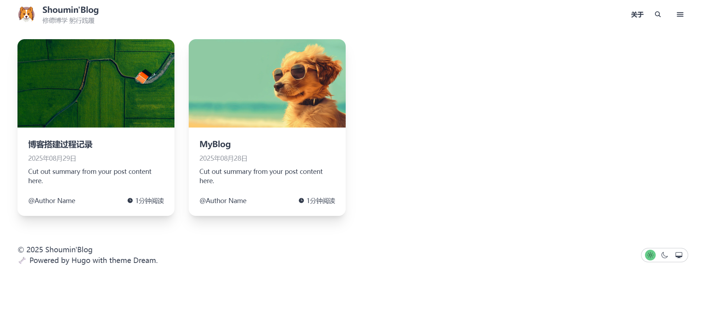
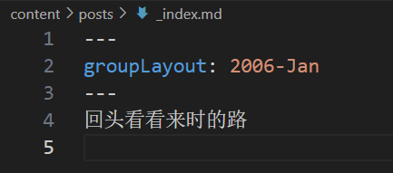

记录我的Hugo博客搭建过程。

<!--more-->

## 起因
搭建个人博客感觉已经是一个程序员的必修课，虽然我不是一个纯正的程序员，但一直很想尝试一下，感受程序员的优雅和浪漫。

## 技术选择
搭建个人博客的技术栈有很多，且都很成熟了，网上的教程也很多，通常照着教程做都能做出来。

本质上来说，个人博客就是一个网站，简单点的可以使用静态站点，想要复杂、功能强大的可以使用动态站点。考虑到我不是专业搞网络编程的，实现静态的个人博客就足够了。

实现静态博客站点的方法有很多，其中Hugo是比较简单的一个，它只需要一行代码就可以搭建一个空白站点，搭配各路大神开发的主题，也能实现优美的页面效果。

使用Hugo只能生成一个本地站点，想要实现外网访问需要将站点托管到互联网上，其中最常用的一种方法是托管到GitHub上。

最终我的选择是：**Hugo、Dream主题、Github Pages**。

## 参考资料
1. Hugo官网：[The world's fastest framework for building websites](https://gohugo.io/)
2. Hugo官方文档：[入门指南 | Hugo官方文档](https://hugo.opendocs.io/getting-started/)
3. Dream主题展示页：[Dream](https://themes.gohugo.io/themes/hugo-theme-dream/)
4. Dream主题文档：[Quick Start | Hugo Theme Dream](https://hugo-theme-dream.g1en.site/)
5. 建站教学视频1：[【博客】24k纯小白 Hugo+Github博客搭建教程 | 超清晰 | 超详细_哔哩哔哩_bilibili](https://www.bilibili.com/video/BV1H5CiYHEQR?spm_id_from=333.788.videopod.sections&vd_source=e4410634235f7aeeaeb7fdfbc5d5a8b4)
6. 建站教学视频2：[【雷】Hugo + Github免费搭建博客，并实现自动化部署_哔哩哔哩_bilibili](https://www.bilibili.com/video/BV1bovfeaEtQ?vd_source=e4410634235f7aeeaeb7fdfbc5d5a8b4&spm_id_from=333.788.videopod.episodes)

## 搭建步骤
### 相关环境准备
1. 【必须】下载并安装Git：[Git - 下载软件包 - Git 版本控制系统](https://git-scm.cn/downloads/win)
2. 【非必须】下载并安装VSCode：[Visual Studio Code - Code Editing. Redefined](https://code.visualstudio.com/)
3. 【必须】下载Hugo并安装：[Release v0.149.0 · gohugoio/hugo](https://github.com/gohugoio/hugo/releases/tag/v0.149.0)
	1. Hugo通过GitHub发布，GitHub在国内访问不稳定，可以使用网络代理，或搜索第三方下载
	2. Hugo在window下只有一个exe文件，需要将所在路径添加到系统环境变量PATH中，以便全局调用
4. 【必须】注册GitHub：[GitHub Dashboard](https://github.com/dashboard)

### Hugo搭建本地站点
Hugo常用命令如下：
1. **hugo version**：查看hugo版本
2. **hugo help**：查看hugo帮助
3. **hugo new site** *mysite*：在mysite目录下创建站点
4. **hugo server**：启动本地站点，默认网址为： http://localhost:1313/ 
5. **hugo new posts/blogtitle**：在content/posts/下创建一个blogtitle的文件夹，其中包含一个index.md的文档作为博客文章
6. **hugo**：生成静态站点文件，会生成publish/目录，常用形式为 *hugo --gc --minify --cleanDestinationDir*，表示生成站点文件时会执行清理和压缩操作

### 下载主题并修改配置
1. Dream主题下载：[Release v3.12.0 · g1eny0ung/hugo-theme-dream](https://github.com/g1eny0ung/hugo-theme-dream/releases/tag/v3.12.0)
2. 解压，并复制到主题文件夹：mysite/themes，重命名为 hugo-theme-dream/
3. 复制hugo-theme-dream/hugo.example.toml 到 mysite/下，并重命名为 hugo.toml
4. 使用vscode打开mysite文件夹
5. 打开根目录下的 hugo.toml，修改配置内容：
	1. 修改基础配置
  
	2. 修改参数配置
  
  
  
  
6. 生成静态站点：hugo --gc --minify --cleanFestinationDir

### 创建GitHub仓库
1. 创建博客发布仓库：username/username.github.io（这个名字可以使博客网址比较简短）

2. 创建博客源码仓库：username/myblog（这个名字可以随意取）
3. 创建 personal access token（入口在个人头像-setting-developer setting/personal access tokens/tokens，用于自动部署，注意复制保存）


4. 关联token：在博客源码仓库中设置Action安全变量，用于授权自动部署


### 创建workflow脚本
1. 在本地站点目录下创建以下目录结构：
mysite/.github/workflow/hugo.yaml
2. 编辑hugo.yoml文件，参考链接：[hugo.yaml](https://github.com/Cycinter/JulesTutorial/blob/master/HugoBlog/hugo.yaml)


### 创建git仓库，同步到GitHub
1. 使用mysite目录下打开终端，执行以下命令初始化仓库：
```
git init
git add .
git commit -m "init commit"
```
2. 配置远程仓库
```
git config user.name <你的GitHub账号>
git config user.email <你的GitHub邮箱>
git remote add origin <你的源码仓库>
```
3. 推送本地仓库到GitHub
```
git push origin main
```
4. 创建GitHub Pages：选择Deploy from a branch:main/root

5. 等部署结束后即可访问博客网站


## 添加博文
### 创建博文
创建博文有两种格式：
```
# 在posts目录创建title博文
hugo new posts/title.md
# 在posts目录创建title文件夹，其中包含index.md博文
hugo new posts/title
```
为了方便管理博文中引用的图片等资源，统一使用第二种创建方法。

### 修改博文属性
博文可设置属性参数参考[dream主题文档](https://hugo-theme-dream.g1en.site/post-page)。

其中比较重要的是：author【作者】、cover【头图】、categories【分类】、tags【标签】、draft【草稿标记】。

### 编写博文
需要使用markdown语法结合html标记来编写博文，推荐使用vscode编写。

obsidian等笔记软件的md语法不一定兼容，需要注意。

### 修改归档页
归档页是按时间顺序展示所有博文的页面，默认按年分组，可以在posts/目录下创建_index.md文件来自定义格式，参考[dream主题文档](https://hugo-theme-dream.g1en.site/archives-page)。

